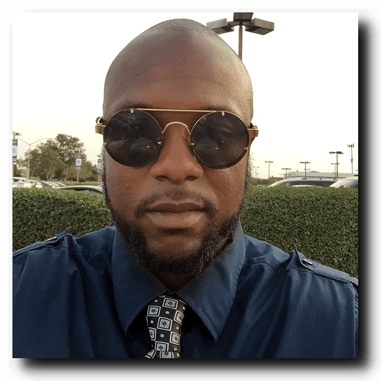
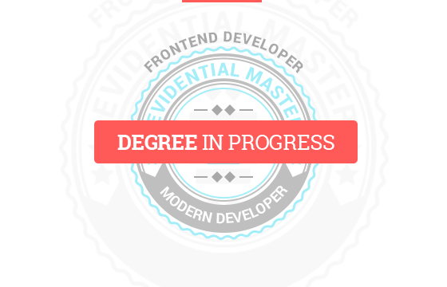
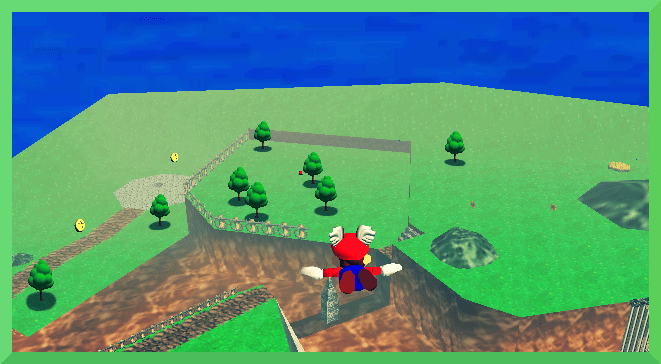

#Andre Watts: The Entrepreneur

##The Explorer
To describe Andre Watts as ambitious would be an understatement.  When he decided to open up a website selling t-shirts in 2013, he was unfettered by a previous lack of web development experience.  With an attitude that defines the very core of "grit," Andre bought [a book on HTML and CSS Development](https://www.amazon.com/gp/product/1118008189/ref=as_li_tf_tl?ie=UTF8&tag=httpwwwhtmlan-20) and started building away.

>After a while it just became routine to open my laptop and learn something new about web development.

  

When asked about his hobbies, Andre confesses a love for Smash Brothers.  His favorite character is Nintendo mascot Mario, and one can see the parallels that would gravitate Andre towards the heroic plumber.

While others may find themselves flustered, perhaps even distraught, over finding themselves suddenly thrust in a strange world, Andre, much like Mario, is not one to question or hesitate.  Whether it be The Mushroom Kingdom or Advanced CSS, both have shown an innate willingness to put their thinking hats on and explore the land.

Indeed, such exploration is baked into Andre's DNA.  He speaks fondly of a trip of New York City.

"One of the best experiences I've ever had was my visit to New York! Just walking down 42nd street was amazing! Those bright lights...They inspire you somehow... We didn't even do anything. We just walked the strip, road the subway, visited all the burrows and met tons of people. I'd do it again in a heartbeat."

##The Autodidact

The explorer spirit applies equally to Andre's philosophies regarding learning and education- set frequent, small goals, and let your ambition be your perseverance.

"I believe in setting lots of small goals to achieve the big goals... I try to practice programming everyday because I know it will open the doors to more opportunities."

>"One summer while I was training for basketball I shot a thousand baskets a day for 2 weeks! Four to six hours of practice in the hot sun everyday... I just wanted to be better. "

This amalgamation of momentum and gradual progress is how Andre finds himself in his current position- one of the best and brightest students of the Modern Developer program.

"I'm pretty familiar with codeschool, udacity, the odin project, freecodecamp, tryregex, coderbyte, youtube tutorials and a bunch of other resources."

##The Artist

Inside Andre lies the soul of a creator.  When describing the reasons he pursued Front-End development, Andre is quick to respond.

"I want users to see my work.

Such fusion of entrepreneurship and art further composes the core of Andre's love of programming.

"I plan on manifesting my ideas from thin air and bringing them to reality. This is why I chose programming."

##The Boss

When discussing his goals, Andre's hard work and dedication in no way overshadows his ambition.  He imagines he'd enjoy opening his own start up.

"I would like to create some kind of digital transaction platform for a certain niche."

One thing's for certain, Andre's name will never be uttered anywhere near the word "Average."  Andre's current goal?

"Become proficient with frontend web technologies beyond job readiness along with building an exceptional portfolio to showcase my talent. That's when Modern Developer comes into play."

Andre's ability to learn, incorporate, and improve- arguably three of the most important skills a leader can posses- is nothing short of outstanding.  When pressed for his favorite quote, Andre providing the following response:

"The capacity to learn is a gift; the ability to learn is a skill; the willingness to learn is a choice." - Brian Herbert

It's a fantastic quote- very true to Andre's character- but I found it quickly overshadowed by Andre's own, more succinct, follow-up response.

>I think a lot of people take being able to learn anything you want for granted. It really is a gift.

